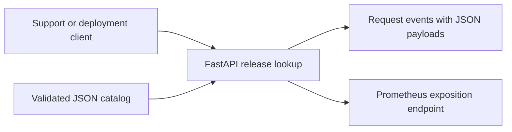

# Production SRE Lab — Release Catalog

A small internal release lookup service used to practice reliable platform delivery. Support engineers and deployment tools need to answer “which build is approved for matchmaking in production?” without depending on a CI server being available.

**Status: Phase 1 local baseline.** The API, tests, request telemetry, Bandit, and Docker build/runtime have local verification. GitHub Actions is configured; hosted execution has not yet been verified. No AWS resources have been deployed. This is hands-on portfolio work, not a claim of operating a production service.

The application deliberately does little: load an approved catalog, validate it, and answer lookups. Infrastructure, delivery, observability, and incident response are the evolving product. See [architecture and milestones](docs/architecture.md), [verification and interview notes](docs/portfolio-notes.md), and [AWS costs](docs/aws-costs.md).



## Run locally

Requires Python 3.13 and a terminal in this repository. The demo releases and commit IDs are synthetic. No credentials are needed.

PowerShell:

```powershell
python -m venv .venv
./.venv/Scripts/python -m pip install -r requirements-dev.lock
./.venv/Scripts/python -m pip install --no-deps -e .
./.venv/Scripts/python -m uvicorn release_catalog.app:create_app --factory --host 127.0.0.1 --port 8000 --no-access-log
```

Linux/macOS use `.venv/bin/python` in place of `./.venv/Scripts/python`. Keep one worker: these metrics are process-local. Stop with Ctrl+C. Dependencies are pinned in the lock files; updating version ranges in `pyproject.toml` alone does not update the reproducible setup.

In a second terminal:

```powershell
curl.exe -i "http://127.0.0.1:8000/v1/releases/matchmaking?environment=production"
curl.exe -i "http://127.0.0.1:8000/v1/releases/unknown?environment=production"
curl.exe -i "http://127.0.0.1:8000/v1/releases/matchmaking?environment=dev"
curl.exe "http://127.0.0.1:8000/metrics"
```

Expected statuses: **200**, **404**, **422**, **200**. On Linux/macOS use `curl`. Open `http://127.0.0.1:8000/docs` for the API schema. The successful lookup returns:

```json
{"service":"matchmaking","environment":"production","version":"2026.09.25","commit":"1234567890abcdef1234567890abcdef12345678"}
```

## Docker path

Requires a running Linux-container Docker daemon and Compose v2 or later. This path was built and verified locally on Docker Desktop's Linux engine:

```powershell
docker compose config
docker compose up --build --wait
# Run the same HTTP examples above.
docker compose logs catalog
docker compose down --volumes --remove-orphans
```

The container runs as UID 10001 with a read-only root filesystem, no Linux capabilities, and a loopback-only host port. The catalog is baked into the image; rebuild to change it. `.env.example` documents the optional catalog path. Native Python reads environment variables, not `.env` files automatically.

## Contract and checks

| Endpoint | Behavior |
|---|---|
| `GET /v1/releases/{service}?environment=production` | Exact service/environment lookup; staging also accepted |
| `GET /health/live` | Process responds; no downstream dependency checks |
| `GET /health/ready` | Valid nonempty catalog is loaded |
| `GET /metrics` | Counter and duration histogram for non-scrape requests |

Catalog input is a JSON array with exactly `service`, `environment`, `version`, and `commit` fields per entry. Fields must be strings matching the schema in `catalog.py`. Missing/null/blank values, invalid types, malformed JSON, empty catalogs, extra fields, and duplicate service/environment keys fail startup. There is no first/last-wins tie-break or partial acceptance. Numeric versions must be written as strings. Lookups are case-sensitive; input is not silently normalized. Changes require a restart.

```powershell
./.venv/Scripts/python -m ruff format --check src tests
./.venv/Scripts/python -m ruff check src tests
./.venv/Scripts/python -m pytest -q
./.venv/Scripts/python -m bandit -r src
./.venv/Scripts/python -m compileall -q .
```

GitHub Actions runs Python checks and a container build/HTTP smoke job on pushes and pull requests. It has no cloud credentials or publishing step. A workflow file is not evidence of a successful hosted run.

## Continue the project

Read [operating and troubleshooting](docs/runbook.md), [telemetry and proposed SLOs](docs/observability.md), and [security scope](docs/security.md). Next, verify hosted CI, then build the local Kubernetes/Helm milestone. Prometheus scraping, Grafana, OpenTelemetry traces, ArgoCD, Terraform, cloud deployment, burn alerts, and incident/postmortem evidence remain future work. Phase 1 does not satisfy the shared SRE readiness gate.
