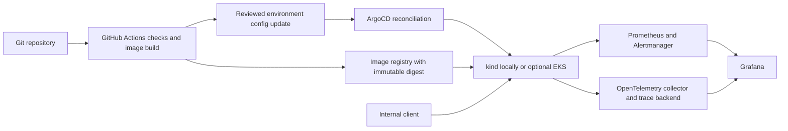

# System design and milestones

## Business scenario

A game platform team maintains an approved build manifest for each service/environment. During an incident, support needs a quick answer independent of the build system. Serving a versioned artifact gives the catalog a simple failure model and makes rollback a deployment operation. The sample is synthetic; it does not contact a real employer's systems.

Phase 1 takes a JSON deployment artifact and HTTP queries, and produces typed release JSON, standard errors, health responses, bounded metrics, and request log events. “Production” is a sample environment label, not a deployment claim. It neither authorizes deployment nor verifies whether an artifact was actually signed/approved upstream.

## Architecture decisions

- FastAPI validates the HTTP contract; Pydantic validates the entire catalog before serving. Fail closed rather than answer from a partially corrupt manifest.
- Separate catalog parsing from HTTP and instrumentation. Unit tests can exercise invalid artifacts without a server.
- Read-only in-memory lookup avoids a database, migrations, credentials, and unnecessary failure modes. Tradeoff: updates need restart/image rollout; no audit trail for writes because writes are out of scope.
- One worker per container makes counters coherent. Later Kubernetes replicas will each expose metrics and Prometheus will aggregate them. A multi-worker Gunicorn deployment would require a different metric strategy.
- Liveness is not a dependency test. Readiness expresses whether this process can serve the loaded catalog. Neither proves external reachability or catalog freshness.
- No public ingress in Phase 1. Auth, TLS, ingress policy, and cloud IAM belong to the deployment boundary before public access.

## Eventual topology — proposed, not built

Repository structure now: `src/release_catalog/` (validation/API), `data/` (synthetic artifact), `tests/`, Dockerfile/Compose, `.github/workflows/`, pinned requirements, and `docs/`. Add `deploy/helm/`, `deploy/gitops/`, `observability/`, and `infra/terraform/` only as their milestones begin. Empty scaffolding would not demonstrate these skills.

## Milestones and review gates

For the ordered commit-sized steps, prerequisites and verification checkpoints within these phases, see the [implementation plan](implementation-plan.md). It is a plan, not evidence that later phases are built.

| Phase | Deliverable and skills | Evidence required before accepting it |
|---|---|---|
| 1: Local baseline | Python 3.13, FastAPI, validation, testing, telemetry foundation, Docker/CI configuration, Bandit | Native server lookup/errors/metrics; tests/lint/security checks; explicit Docker/hosted-CI limitations |
| 2: Local delivery | kind, Helm, Kubernetes probes/resources/security context, ArgoCD, GitHub Actions container delivery; Trivy, Gitleaks, SBOM | Clean install, Helm lint/render, digest-based rollout and rollback, GitOps drift recovery, actual scan outputs; never store a cluster-admin kubeconfig in CI |
| 3: Reliability exercise | Prometheus, Grafana, OTel collector and traces, SLI/SLO/error budgets, Alertmanager | Traffic generation, screenshots from real dashboard/traces, tested alert rules, bounded fault exercise, timestamps, runbook, postmortem and recovery verification |
| 4: Optional cloud | Terraform AWS, IAM/OIDC, network design, Checkov, Terraform fmt/init/validate/plan | Approved priced plan, actual deploy and destroy evidence, residual-resource audit; optional separate short EKS exercise |
| Final review | Portfolio communication and technical defense | Fresh clone setup, honest capability matrix, security/troubleshooting review, project descriptions, 2–4 evidence-backed resume bullets and interview talking points |

Phase 1 ends after its handoff. Do not activate another project or treat a test-only exception as a completed production incident exercise.

## Local versus AWS

Local Python and Docker are the baseline. kind on Docker will run Kubernetes, Helm, ArgoCD, Prometheus, Grafana and the trace backend using local resources; plan roughly 4 CPUs/8 GB available initially and measure rather than promise capacity.

Cheapest practical optional AWS demo: one small Lightsail Linux VM running the application container, without a managed load balancer, NAT gateway, database, or managed Kubernetes. Access privately through a tunnel until TLS/auth boundaries are implemented. Terraform manages its lifecycle later. This sacrifices high availability, and must be described as a small cloud deployment.

Local kind is Kubernetes practice, not EKS experience. Optional EKS uses a supported version, explicitly priced worker nodes, restricted API access and a short-lived cluster. Cloud observability sizing and private-network architecture must be priced separately before approval. See the cost document.
