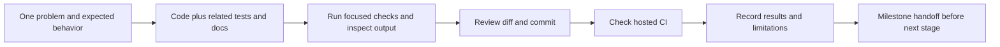
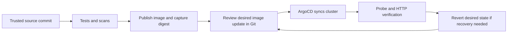

# Implementation plan: one reviewable change at a time

The local API, Docker runtime and hosted CI are verified. Everything below is **planned**, not implemented. This is the execution sequence within the existing architecture phases; it does not open the other portfolio projects or authorize paid deployment.

## How each change will be reviewed

One commit should answer one engineering question. Include the implementation, directly relevant tests and the short explanation needed to review it together. Prefer a few related files and roughly 50–200 hand-written changed lines when practical; this is a review aid, not a quota. Explain larger generated lock files or manifests separately. Split a change when it introduces a second independent behavior, not merely to make the history longer.

For each step: explain the problem and tradeoff, implement the smallest working slice, inspect the diff, run focused checks, record actual results, then commit. Keep main runnable. Do not create empty placeholders, backdate commits, invent failed experiments, or rewrite completed history to simulate progress. Planned commit titles below are suggestions; actual messages must describe the final change.

Each milestone handoff includes: commands a reviewer can reproduce, expected and observed results, cleanup, one tradeoff, one interview question with an answer, and remaining limitations. Update `portfolio-notes.md` as work happens. Diagrams describe implemented behavior unless prominently marked as proposed. A red check is investigated before building the next feature.

## Stage A — maintainable delivery checks

Prerequisite: current Phase 1 green CI. Scope: improve the existing delivery path without changing API behavior.

| Step / suggested commit | Small change and review question | Verification and evidence |
|---|---|---|
| A1 `ci: update actions to supported runtimes` | Update checkout/setup-python references to reviewed supported releases, pin full action SHAs with version comments. Why does each action need its permissions? | Both current jobs pass; Node 20 annotation is gone; record references and run URL. Keep runner-image changes separate if needed. |
| A2 `ci: scan git history for secrets` | Add Gitleaks with full-history checkout and explicit version; retain redacted output. Can a newly introduced secret fail CI? | Clean history passes; disposable local fixture containing only a documented fake test token fails. Never commit a real secret or fixture to project history. |
| A3 `ci: scan the built container image` | Run Trivy on the same image that passed smoke checks; define severity and fix-availability policy. What blocks delivery? | Record scan version/database time and actual findings; resolve findings or justify narrowly scoped, expiring exceptions. Test exit behavior without blanket ignores. |
| A4 `ci: attach a container software inventory` | Generate an SPDX or CycloneDX SBOM and upload it with the image identity. What artifact did we inventory? | Download and parse the artifact; confirm the application and a known dependency are listed and match the tested image. |

Handoff A: explain the difference between tests, static analysis, secret detection, vulnerability scanning and an SBOM. No scan claims safety by itself. Existing Bandit remains in place.

## Stage B — Helm deployment on local kind

Prerequisite: A. Scope: one local cluster and one application; no ArgoCD or monitoring stack yet.

| Step / suggested commit | Small change and review question | Verification and evidence |
|---|---|---|
| B1 `docs: add a reproducible kind cluster setup` | Choose tested kind/kubectl versions and node image; add minimal named cluster config plus create/delete instructions. Which cluster will a command modify? | Create cluster, verify explicit context and Ready node, delete and recreate. Record resource requirements and versions. |
| B2 `feat: package the release catalog as a Helm chart` | Add Deployment, ClusterIP Service and a small values file; include existing probes, non-root/read-only settings and initial resource requests/limits. How does traffic reach a ready pod? | Helm lint/template pass; load the local image into kind; install with a bounded wait; port-forward and verify 200/404/422. Inspect rendered security settings. |
| B3 `test: verify chart configuration in CI` | Add Helm lint/render checks, values validation and useful failure messages. What configuration mistakes fail before deployment? | Valid values pass; missing image or invalid port fails a focused negative case. Add chart commands to the local guide. |
| B4 `docs: demonstrate a failed rollout and rollback` | Document and execute an isolated rollout using an intentionally nonexistent image tag, then restore the prior Helm revision. How is service restored? | Capture revision history, rollout failure, rollback and successful lookup; explicitly select the lab context/namespace. Do not imply zero downtime unless traffic measurements establish it. |

Handoff B: a new checkout can create the cluster, install the chart, reproduce the failure/recovery and delete the cluster. The chart may need more than one commit if its initial diff is large; keep each slice renderable. No generated umbrella chart or unused optional features.

## Stage C — GitOps delivery

Prerequisite: B accepted. Scope: move the same application under a Git-controlled deployment flow.

| Step / suggested commit | Small change and review question | Verification and evidence |
|---|---|---|
| C1 `ci: publish verified images by commit` | Publish to GHCR only from the trusted branch after checks; give the publishing job only necessary package permissions. How does a commit map to an image digest? | Pull the published image by digest and repeat smoke checks. PRs cannot publish. Record digest and ensure a clean clone can pull the intended public image. |
| C2 `feat: reconcile the catalog with ArgoCD` | Document a pinned local ArgoCD install; add one restricted AppProject/Application and environment values using the reviewed digest. Which tool owns the deployment? | Plan the Helm-to-Argo ownership handoff explicitly; sync successfully, inspect healthy state and repeat HTTP checks. Keep credentials out of Git. |
| C3 `docs: exercise GitOps drift and recovery` | Change one harmless live field, observe reconciliation, then exercise rollback by reverting desired state in Git. Why does a manual rollback alone not persist? | Capture desired/live diff, self-heal, Git revert and restored version. Explain any downtime and leave the cluster consistent with Git. |

Start with a manually reviewed digest update. A later bot-created update PR is optional only if repetition warrants it; CI never needs cluster-admin credentials. Once ArgoCD owns the app, recovery uses Git rather than a competing Helm release manager.

This diagram is the Stage C target, not today's CI. Handoff C requires actual image publication, sync, drift and recovery evidence.

## Stage D — telemetry that answers operational questions

Prerequisite: C; keep the single-process metrics contract and existing labels.

| Step / suggested commit | Small change and review question | Verification and evidence |
|---|---|---|
| D1 `feat: scrape catalog metrics with Prometheus` | Add bounded local scraping/storage configuration and a setup guide. Is the target healthy, and which requests are included? | Confirm target UP and counters for known traffic; restart app and verify rate behavior across counter reset. |
| D2 `feat: add a release catalog dashboard` | Add one versioned Grafana dashboard for traffic, errors and threshold latency. What does no traffic look like? | Capture real traffic/no-data views; identify units, filters and datasource setup. Avoid decorative panels without an operational question. |
| D3 `feat: export request traces with OpenTelemetry` | Add minimal API instrumentation with an optional exporter setting; pair it with one local collector/backend configuration. What work explains a slow request? | Find a real trace and correlate request context; verify API still works if the collector is unavailable. Measure overhead before making performance claims. |

Handoff D: a newcomer can send a request and find its metrics, log event and trace. Explain storage/retention and remove local telemetry volumes when intentionally discarding lab data.

## Stage E — SLOs, alerts and an incident exercise

Prerequisite: D. The definitions in `observability.md` are proposals until these steps are verified.

| Step / suggested commit | Small change and review question | Verification and evidence |
|---|---|---|
| E1 `feat: calculate request SLOs and error budgets` | Implement recording rules from the documented eligibility and zero-traffic contract. What is the denominator? | Test all-success, all-failure, mixed responses, no traffic and absent series with rule fixtures; show a hand-calculated example. |
| E2 `feat: alert on sustained error budget burn` | Add tested fast/slow burn rules plus probe/missing-data detection and runbook links. When does an operator need to act? | Rule tests cover firing, non-firing and recovery; route notifications to a local receiver first, with no unsolicited external messages. |
| E3 `feat: add a bounded local fault exercise` | Choose one realistic failure and an explicit timeout/cleanup path; prefer deployment/config faults over a public fault API. Can the drill safely restore the lab? | Demonstrate both the injected fault and automatic/manual cleanup. Keep synthetic load bounded and local. |
| E4 `docs: record the incident and corrective action` | Execute the drill and write the factual timeline, impact, detection, mitigation and contributing causes. What evidence supports the diagnosis? | Include observed graphs/alerts, recovery checks and limitations. Follow-up code fixes get their own focused commits tied to the cause. |

Handoff E: inspect the end-to-end local delivery and reliability evidence against the shared SRE readiness gate. This does not automatically activate another engineering project.

## Stage F — optional AWS, with a separate cost decision

Prerequisite: local reliability handoff. No paid resources are authorized by this plan.

| Step / suggested commit | Small change and review question | Verification and evidence |
|---|---|---|
| F1 `docs: select and price the cloud demo` | Refresh official regional pricing; choose VM scope, runtime cap and shutdown inventory. Is the expected evidence worth the cost? | Review a concrete estimate and explicit user approval before apply. A VM is not EKS. |
| F2 `feat: describe the approved AWS demo in Terraform` | Add only the selected infrastructure with tags, scoped access and outputs; document state handling. What survives compute deletion? | Terraform fmt/init/validate/plan plus Checkov. Split IAM/state/network changes if independently substantial. Inspect the plan; no apply hidden in tests. |
| F3 `docs: verify cloud deployment and teardown` | After approval, run the planned deployment, verify access and collect evidence, then destroy it. | Record actual resources, HTTP results, destroy output and residual-resource/cost review. EKS requires its own priced decision and evidence. |

## Final review and the next implementation step

After the agreed engineering scope is complete, audit setup/docs against a clean checkout, then write defensible project descriptions, skills, interview material and resume bullets. Claims must point to evidence. Treat any review fixes as normal scoped commits.

**Next implementation step: A1 only.** This planning change does not implement A1–F3. Complete and review A1 before proceeding to A2; give a milestone handoff at A, B, C, D and E rather than delivering the whole platform in one batch.
