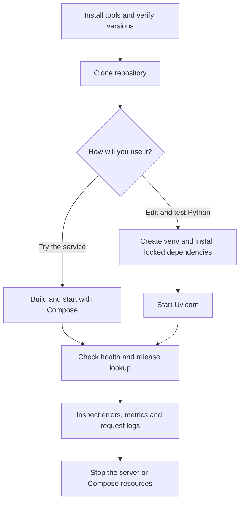
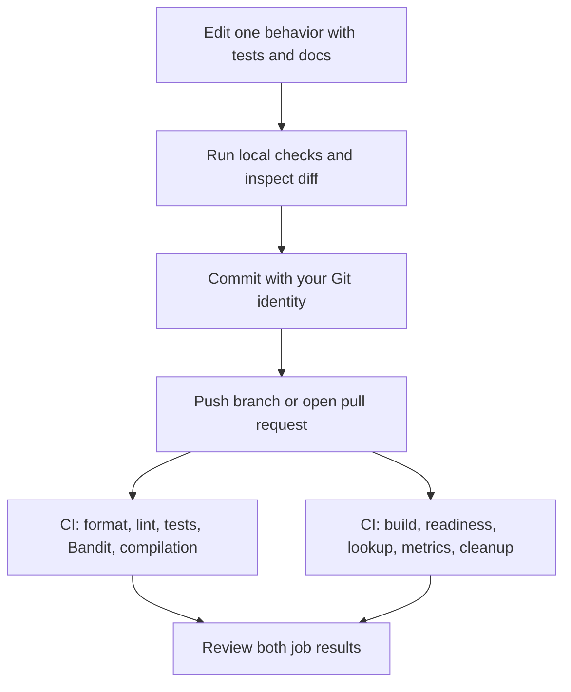

# First-time local setup

This guide runs the **existing Phase 1 application**. Start with Docker to try the service, or use native Python to edit and test it. No AWS account, GitHub login, API key, Kubernetes cluster or `.env` file is needed. Downloading source, images and Python packages requires internet access.

## 1. Install the tools once

| Tool | When needed | Install / check |
|---|---|---|
| Git | Both paths | [Git installation](https://git-scm.com/install/windows) for Windows; use the matching platform from that site. Check `git --version`. |
| Docker with Compose | Container path | [Docker Desktop for Windows](https://docs.docker.com/desktop/setup/install/windows-install/) or [your platform's installation](https://docs.docker.com/get-started/get-docker/). Start Docker Desktop after installation and use Linux containers. |
| Python 3.13 | Native development only | Install Python 3.13 from [Python.org](https://www.python.org/downloads/). On Windows include the Python launcher; on Linux install venv support with your Python distribution. Check `py -3.13 --version` on Windows or `python3.13 --version` on Linux/macOS. |

On Windows, Docker's WSL backend requires WSL 2. If it is not installed, follow [Microsoft's first-time WSL setup](https://learn.microsoft.com/en-us/windows/wsl/install): run `wsl --install` in an administrator PowerShell and restart when requested. Finish any first-launch Linux user setup. Then install/start Docker Desktop and wait for its engine to be ready. Commands in this guide can run from Windows PowerShell; an Ubuntu terminal is optional.

Reopen your terminal after installing tools so updated executable paths are available. Keep a native Windows virtual environment separate from one created inside WSL; do not share `.venv` across operating systems.

For the Docker path, check:

```text
docker version
docker compose version
```

`docker version` must show **both Client and Server**, with Linux as the server OS. A client version by itself does not prove the engine is running. Compose v2 or later is required. The verified environment used Docker Desktop on Windows with a Linux engine; the project also passed its Ubuntu-hosted CI. A fresh macOS/WSL-native installation has not been verified here.

## 2. Copy the repository

Open PowerShell on Windows or a terminal on Linux/macOS. Start in a parent folder you own, with no existing `production-sre-lab` subfolder:

```text
git clone https://github.com/mayamoh-indie/production-sre-lab.git
cd production-sre-lab
git status --short
```

An empty status means the checkout is clean. Run all remaining commands from this repository directory unless told otherwise. If you already cloned it, use that checkout rather than cloning inside it. See the [returning-user workflow](#returning-to-the-project) before pulling over local edits.



## 3A. Run the container

Use this path **or** 3B at a time; both bind port 8000.

```text
docker compose config --quiet
docker compose up --build --wait --wait-timeout 60
docker compose ps
```

Expected: the `catalog` container is **healthy**, with port `127.0.0.1:8000`. The first build downloads dependencies; the 60-second timeout applies to waiting for readiness, not the entire build. The command returns while the service continues running. No host Python installation is needed.

Continue at step 4. If startup fails, inspect `docker compose logs --tail 50 catalog` before retrying. A failed command is not a successful installation.

## 3B. Run native Python for development

Windows PowerShell:

```powershell
py -3.13 -m venv .venv
./.venv/Scripts/python -m pip install -r requirements-dev.lock
./.venv/Scripts/python -m pip install --no-deps -e .
./.venv/Scripts/python -m pip check
./.venv/Scripts/python -m pytest -q
./.venv/Scripts/python -m uvicorn release_catalog.app:create_app --factory --host 127.0.0.1 --port 8000 --no-access-log
```

Linux/macOS or a separate WSL-native checkout with Python 3.13 installed:

```bash
python3.13 -m venv .venv
.venv/bin/python -m pip install -r requirements-dev.lock
.venv/bin/python -m pip install --no-deps -e .
.venv/bin/python -m pip check
.venv/bin/python -m pytest -q
.venv/bin/python -m uvicorn release_catalog.app:create_app --factory --host 127.0.0.1 --port 8000 --no-access-log
```

Stop if any command fails. Expected: no broken requirements, **26 passing tests** at the current baseline, then `Application startup complete`. A known Starlette/HTTPX deprecation warning is documented in the evidence notes; it is not a test failure. The terminal stays attached to the server. Open a second terminal in the repository for step 4.

The explicit Python path avoids activation and PowerShell execution-policy changes. `--no-deps -e .` installs this source as an editable package after locked dependencies have been installed. Keep one worker so the process-local metrics remain coherent.

## 4. Send requests and inspect the result

Windows PowerShell:

```powershell
curl.exe -i "http://127.0.0.1:8000/health/ready"
curl.exe -i "http://127.0.0.1:8000/v1/releases/matchmaking?environment=production"
curl.exe -i "http://127.0.0.1:8000/v1/releases/unknown?environment=production"
curl.exe -i "http://127.0.0.1:8000/v1/releases/matchmaking?environment=dev"
curl.exe "http://127.0.0.1:8000/metrics"
```

Linux/macOS/WSL:

```bash
curl -i 'http://127.0.0.1:8000/health/ready'
curl -i 'http://127.0.0.1:8000/v1/releases/matchmaking?environment=production'
curl -i 'http://127.0.0.1:8000/v1/releases/unknown?environment=production'
curl -i 'http://127.0.0.1:8000/v1/releases/matchmaking?environment=dev'
curl 'http://127.0.0.1:8000/metrics'
```

| Request | Expected result | What it proves |
|---|---|---|
| Readiness | 200, `{"status":"ready"}` | The catalog loaded successfully |
| Known production release | 200, version `2026.09.25` | Lookup works against the synthetic artifact |
| Unknown service | 404, `Release not found` | A missing record is handled intentionally |
| Invalid environment | 422 validation response | The HTTP contract rejects unsupported values |
| Metrics | 200, Prometheus text | Request counts and duration buckets are exposed |

The 404 and 422 above are deliberate checks, not setup failures. `production` is a sample catalog label, not an AWS deployment. Counter values grow as you send requests and reset on process restart. Compose health checks also generate readiness traffic. The lookup series uses `/v1/releases/{service}`, not a separate label per service name.

Open [API docs](http://127.0.0.1:8000/docs) in your browser to try the schema interactively. Look for the `X-Request-ID` response header, then find that ID in the native server terminal or container logs:

```text
docker compose logs --tail 30 catalog
```

Request events contain JSON payloads prefixed by the server logger. There is no Grafana dashboard, Prometheus scraper or trace backend yet; `/metrics` alone does not provide those services.

## 5. Stop and clean up

Native Python: press **Ctrl+C in the server terminal**. Your virtual environment remains for next time.

Docker, from the repository:

```text
docker compose down --volumes --remove-orphans
docker compose ps --all
```

Expected: no project containers remain. This removes this Compose project's resources, not Docker Desktop itself. The built image and download cache remain for reuse. Do not use a global Docker prune command as routine project cleanup.

## Returning to the project

Check `git status` and preserve any changes you want to keep before updating. From a clean checkout, `git pull --ff-only` updates without creating an accidental merge. If Git reports divergent history, inspect it rather than forcing a reset.

- Container path: rerun `docker compose up --build --wait --wait-timeout 60` after source/catalog changes.
- Native path: rerun the locked dependency/package install commands after dependency changes, then run tests and start the server. No need to recreate an existing compatible `.venv` each time.
- Catalog data loads at startup; editing `data/releases.json` requires a restart. Compose bakes it into the image, so also rebuild.
- Defaults need no `.env`. If you deliberately change `CATALOG_PATH`, it must name a readable file inside the chosen runtime. A host path does not automatically exist inside a container.

## Before committing a change

Windows PowerShell; on Linux/macOS replace `./.venv/Scripts/python` with `.venv/bin/python`:

```powershell
./.venv/Scripts/python -m ruff format --check src tests
./.venv/Scripts/python -m ruff check src tests
./.venv/Scripts/python -m pytest -q
./.venv/Scripts/python -m bandit -r src
./.venv/Scripts/python -m compileall -q .
git diff --check
git diff
```

These are checks, not automatic commits. Review your diff and stage only the files for one change. Check your own `git config user.name` and `git config user.email`; do not copy the repository owner's identity. Reading/cloning/running this public repository needs no GitHub authentication. Contributing requires your own fork or repository permissions.



This is today's workflow. CI does not publish an image or deploy to Kubernetes/AWS yet. See the [implementation plan](implementation-plan.md) for those proposed stages.

## Common first-run problems

| Symptom | Next check |
|---|---|
| Tool not found | Reopen terminal, verify installation/PATH, and run the version command |
| Docker shows only Client | Start Docker Desktop; confirm Linux engine and inspect `docker context ls` |
| Docker/WSL access denied | Check from your normal user terminal. A restricted execution sandbox may lack access even when Docker works; do not change system permissions blindly |
| Cannot create venv | Confirm Python 3.13 and its venv support; do not substitute a different version silently |
| Port 8000 already used | Stop your earlier native/Compose instance; do not kill unrelated processes |
| Catalog cannot load | Confirm repository working directory and any `CATALOG_PATH` override; see [runbook](runbook.md) |
| Metrics exist but no graphs | Expected at Phase 1; visualization arrives in the planned telemetry stage |

For the observed versions/results and known limitations, see [portfolio notes](portfolio-notes.md). Add future kind/Helm/Argo instructions only when those milestones are implemented and tested.
